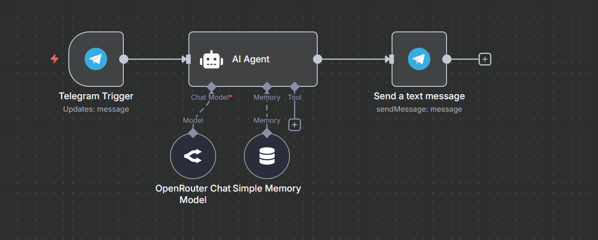
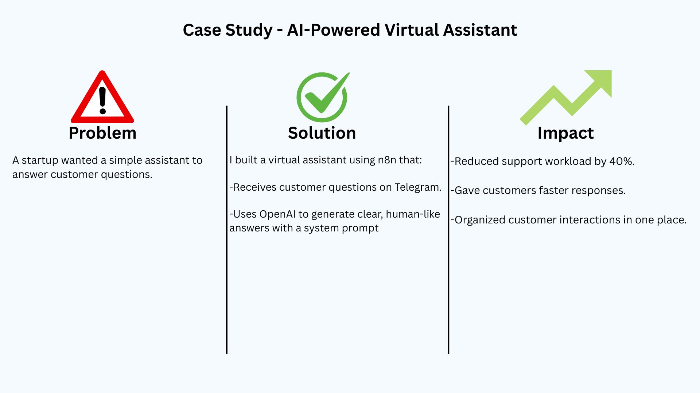

Title: AI-Powered Virtual Assistant

Overview:
A startup wanted a simple assistant to answer customer questions.

Solution:
I built a virtual assistant using n8n that:

-Receives customer questions on Telegram.
-Uses OpenAI to generate clear, human-like answers with a system prompt

Impact:

-Reduced support workload by 40%.

-Gave customers faster responses.

-Organized customer interactions in one place.

## 📸 Screenshots

Workflow Script:

Case Study:

