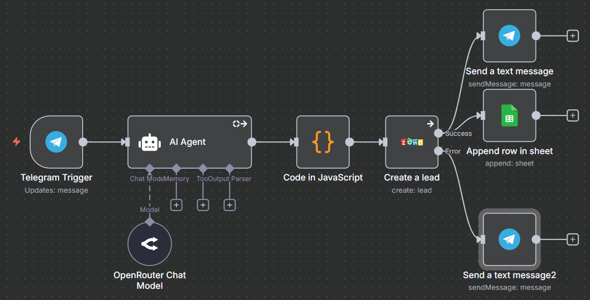
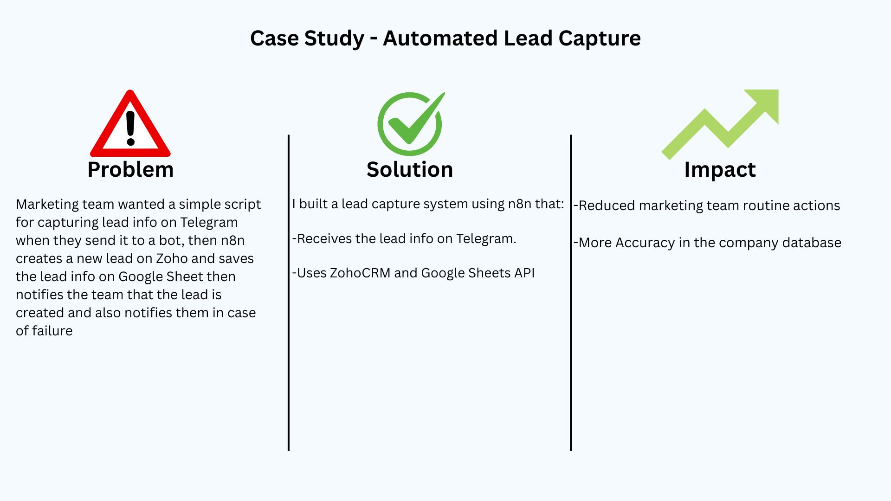

Title: Automated Lead Capture

Overview:
Marketing team wanted a simple script for capturing lead info on Telegram when they send it to a bot, then n8n creates a new lead on Zoho and saves the lead info on Google Sheet then notifies the team that the lead is created and also notifies them in case of failure

Solution:
I built a lead capture system using n8n that:

-Receives the lead info on Telegram.
-Uses ZohoCRM and Google Sheets API

Impact:

-Reduced marketing team routine actions

-More Accuracy in the company database

## 📸 Screenshots

Workflow Script:

Case Study:

