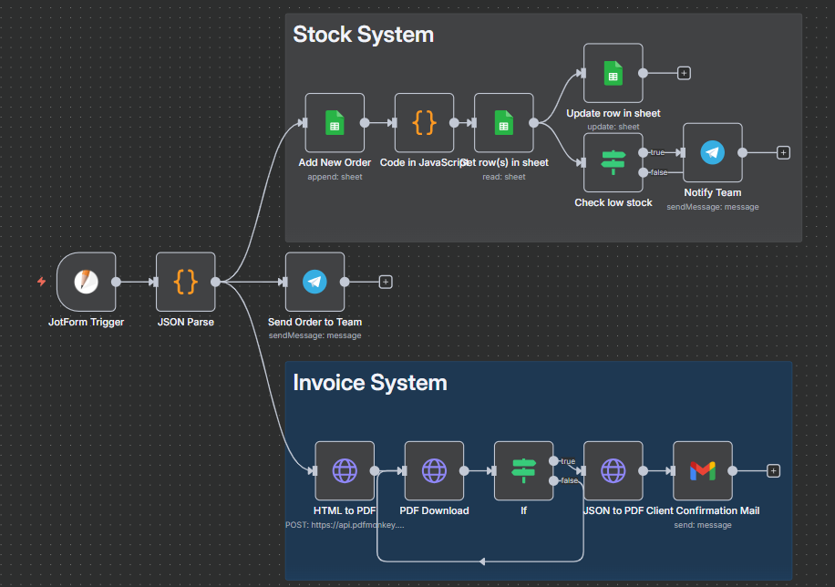
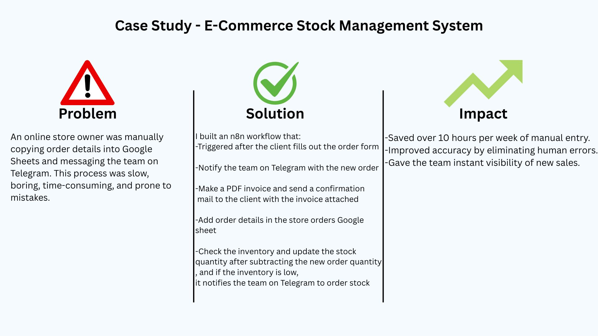

Title: E-Commerce Stock Management System

Overview: An online store owner was manually copying order details into Google Sheets and messaging the team on Telegram. This process was slow, boring, time-consuming, and prone to mistakes.

Solution:

I built an n8n workflow that:

-Triggered after the client fills out the order form

-Notify the team on Telegram with the new order

-Make a PDF invoice and send a confirmation mail to the client with the invoice attached

-Add order details in the store orders Google sheet

-Check the inventory and update the stock quantity after subtracting the new order quantity, and if the inventory is low, it notifies the team on Telegram to order stock

Impact:

-Saved over 10 hours per week of manual entry.

-Improved accuracy by eliminating human errors.

-Gave the team instant visibility of new sales.

## 📸 Screenshots

Main dashboard:

Stock update flow:

