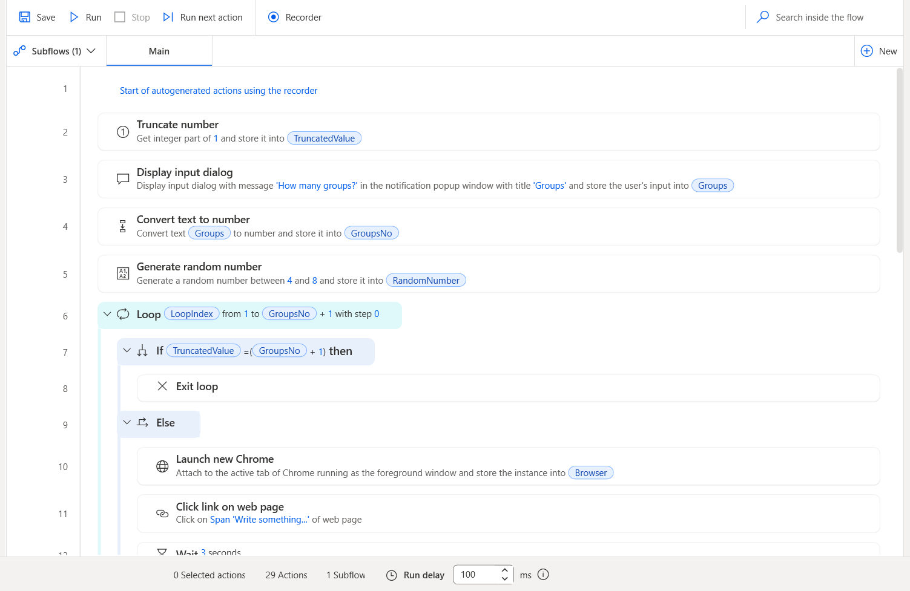
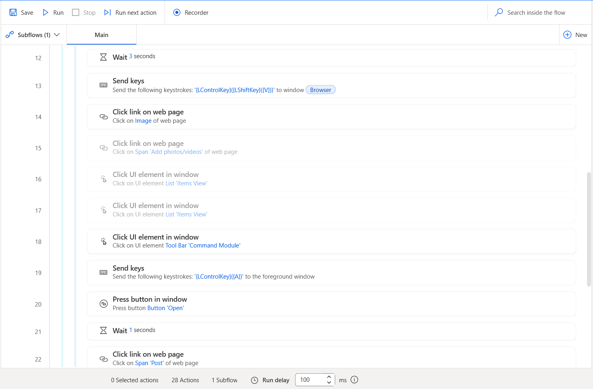
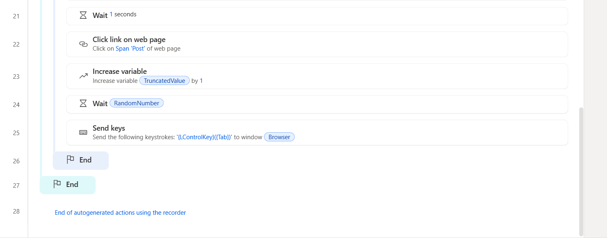
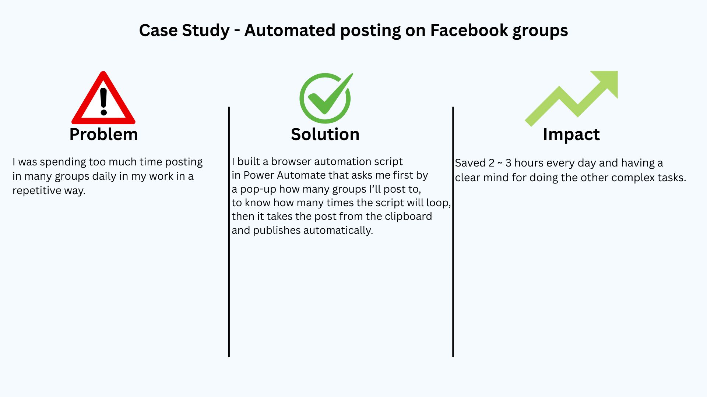

Title: Automated posting on Facebook groups

Overview: I was spending too much time posting in many groups daily in my work in a repetitive way.

Solution: I built a browser automation script in Power Automate that asks me first by a pop-up how many groups I’ll post to, to know how many times the script will loop, then it takes the post from the clipboard and publishes automatically.

Impact: Saved 2 ~ 3 hours every day and having a clear mind for doing the other complex tasks.

## 📸 Screenshots

Workflow Script:
  
  
  

Case Study:

