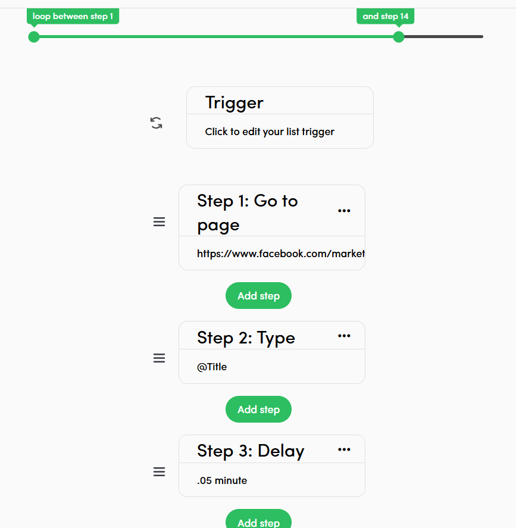
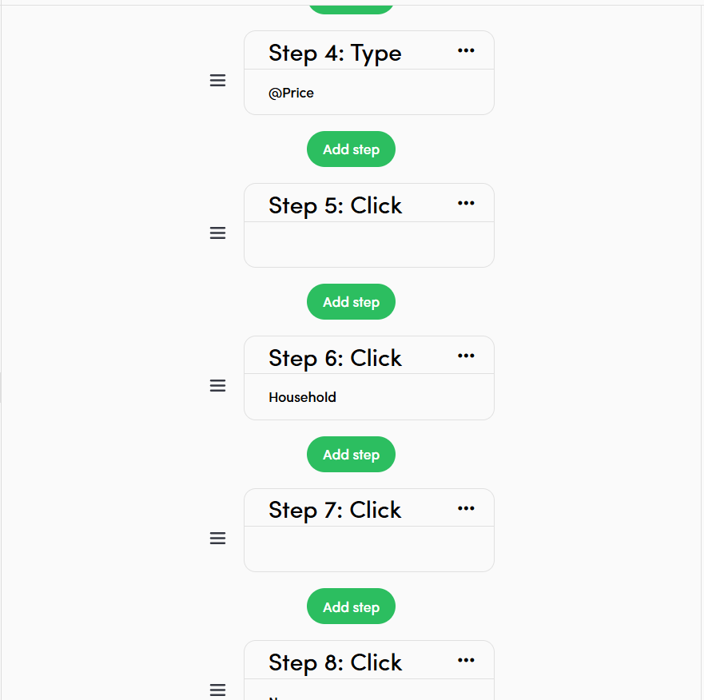
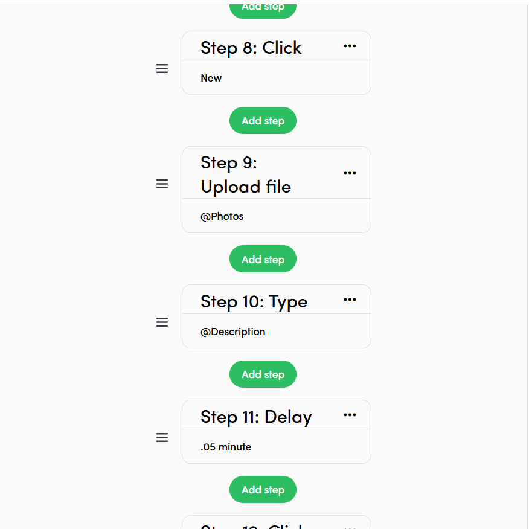
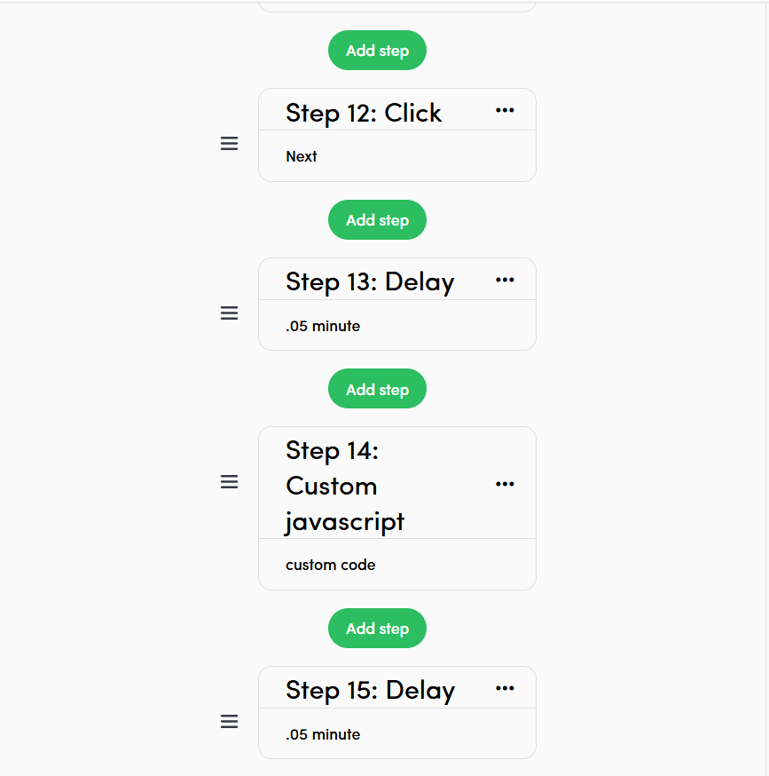
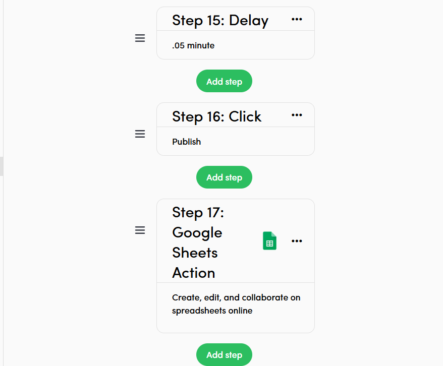
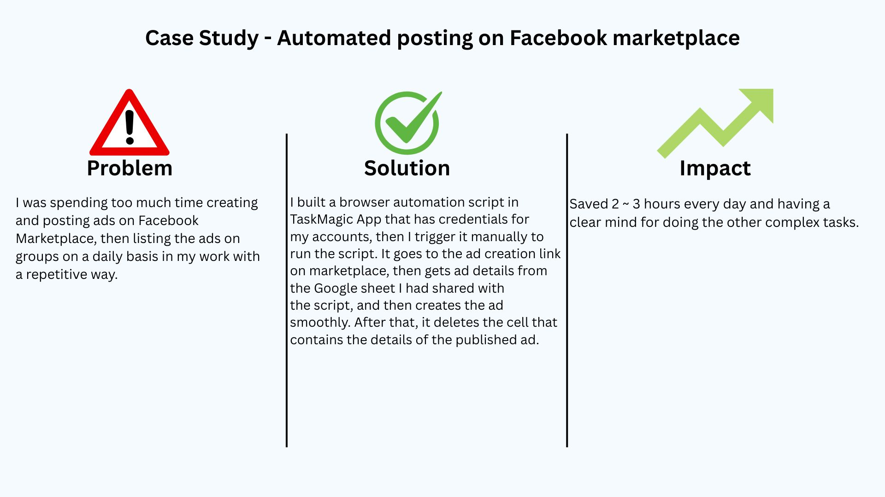

Title: Automated posting on Facebook marketplace

Overview: I was spending too much time creating and posting ads on Facebook Marketplace, then listing the ads on groups on a daily basis in my work with a repetitive way.

Solution: I built a browser automation script in TaskMagic App that has credentials for my accounts, then I trigger it manually to run the script. It goes to the ad creation link on marketplace, then gets ad details from the Google sheet I had shared with the script, and then creates the ad smoothly. After that, it deletes the cell that contains the details of the published ad.

Impact: Saved 2 ~ 3 hours every day and having a clear mind for doing the other complex tasks.

## 📸 Screenshots

Workflow Script:

  
  
  
  
  

Case Study:

